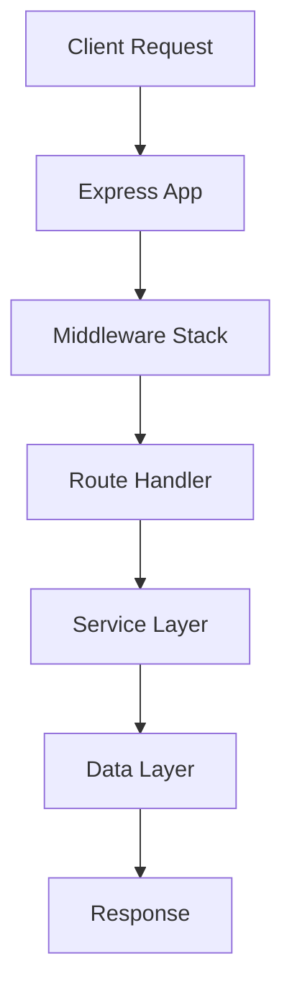

# UK Home Improvement Platform - Code Flow Guide

## 📋 Table of Contents
1. [Application Architecture](#application-architecture)
2. [Entry Points](#entry-points)
3. [Request Flow](#request-flow)
4. [Key Components](#key-components)
5. [Data Models](#data-models)
6. [Service Layer](#service-layer)
7. [Frontend Architecture](#frontend-architecture)
8. [Development Workflow](#development-workflow)

## 🏗️ Application Architecture

The platform follows a **microservices-inspired monolithic architecture** with clear separation of concerns:

```
┌─────────────────┐    ┌─────────────────┐    ┌─────────────────┐
│   Frontend      │    │   Backend API   │    │   AWS Services  │
│   (React)       │◄──►│   (Node.js)     │◄──►│   (DynamoDB,    │
│                 │    │                 │    │    S3, Bedrock) │
└─────────────────┘    └─────────────────┘    └─────────────────┘
```

## 🚀 Entry Points

### 1. Development Server (`src/simple-server.ts`)
- **Purpose**: Lightweight development server with mock data
- **Port**: 3000
- **Features**: Mock authentication, basic CRUD operations
- **Usage**: `npm run dev`

### 2. Production Server (`src/index.ts`)
- **Purpose**: Full-featured production server
- **Features**: Redis, WebSocket, comprehensive services
- **Usage**: `npm run dev:full-app`

### 3. Lambda Handler (`src/lambda-handler.ts`)
- **Purpose**: AWS Lambda deployment
- **Features**: Serverless execution, AWS service integration
- **Usage**: Deployed via CloudFormation

## 🔄 Request Flow

### Step-by-Step Request Processing



### 1. **Middleware Stack** (`src/app.ts`)
```typescript
// Security & CORS
app.use(helmet());
app.use(cors());

// Request parsing
app.use(express.json());

// Request ID & logging
app.use(requestIdMiddleware);
app.use(loggingMiddleware);
```

### 2. **Route Resolution** (`src/app.ts`)
```typescript
// API routes mounted in order
app.use('/api/auth', authRoutes);
app.use('/api/users', userRoutes);
app.use('/api/projects', projectRoutes);
app.use('/api/documents', documentRoutes);
// ... more routes
```

### 3. **Authentication Flow**
```typescript
// 1. Login request → AuthService
POST /api/auth/login
├── Validate credentials
├── Generate JWT token
└── Return user + token

// 2. Protected routes → Auth middleware
GET /api/projects (with Bearer token)
├── Extract token from header
├── Verify JWT signature
├── Attach user to request
└── Continue to route handler
```

## 🧩 Key Components

### 1. **Configuration** (`src/config/`)
- `index.ts`: Main configuration aggregator
- `aws.ts`: AWS service configurations
- `redis.ts`: Redis connection management

### 2. **Models** (`src/models/`)
- `User.ts`: User entity and validation
- `Project.ts`: Project lifecycle management
- `ScopeOfWork.ts`: SoW generation and storage
- `Quote.ts`: Builder quote management
- `Contract.ts`: Contract generation

### 3. **Services** (`src/services/`)
- `AuthService.ts`: Authentication & authorization
- `ProjectService.ts`: Project CRUD operations
- `DocumentService.ts`: File upload & processing
- `SoWGenerationService.ts`: AI-powered SoW creation
- `NotificationService.ts`: Email & push notifications

### 4. **Routes** (`src/routes/`)
Each route file handles specific API endpoints:
```typescript
// Example: projects.ts
router.post('/', createProject);      // POST /api/projects
router.get('/', getProjects);         // GET /api/projects
router.get('/:id', getProject);       // GET /api/projects/:id
router.put('/:id', updateProject);    // PUT /api/projects/:id
```

## 📊 Data Models

### DynamoDB Single-Table Design
```
PK (Partition Key) | SK (Sort Key)     | Entity Type
-------------------|-------------------|-------------
USER#123          | METADATA          | User
USER#123          | PROFILE           | User Profile
PROJECT#456       | METADATA          | Project
PROJECT#456       | SOW#789           | Scope of Work
PROJECT#456       | QUOTE#101         | Quote
BUILDER#789       | METADATA          | Builder
```

### Key Relationships
```typescript
// User → Projects (1:many)
User.id → Project.ownerId

// Project → ScopeOfWork (1:1)
Project.id → ScopeOfWork.projectId

// Project → Quotes (1:many)
Project.id → Quote.projectId

// Project → Documents (1:many)
Project.id → Document.projectId
```

## ⚙️ Service Layer

### 1. **Project Creation Flow**
```typescript
// 1. Client submits project data
POST /api/projects
{
  "propertyAddress": {...},
  "projectType": "loft-conversion",
  "requirements": {...}
}

// 2. ProjectService.createProject()
├── Validate input data
├── Generate unique project ID
├── Save to DynamoDB
├── Trigger council data check
└── Return project object

// 3. Background processes
├── CouncilDataService.checkProperty()
├── ComplianceService.validateRequirements()
└── NotificationService.sendConfirmation()
```

### 2. **SoW Generation Flow**
```typescript
// 1. Trigger SoW generation
POST /api/sow/generate { projectId: "123" }

// 2. SoWGenerationService.generateSoW()
├── Fetch project details
├── Analyze uploaded documents (AWS Textract)
├── Generate SoW content (AWS Bedrock)
├── Apply UK compliance rules
├── Save generated SoW
└── Update project status

// 3. AI Processing Pipeline
├── Document extraction → Textract
├── Content analysis → Claude 3.5 Sonnet
├── Compliance check → Custom rules
└── Template generation → Structured output
```

### 3. **Quote Management Flow**
```typescript
// 1. Builder submits quote
POST /api/quotes
{
  "projectId": "123",
  "builderId": "456",
  "totalCost": 25000,
  "breakdown": {...}
}

// 2. QuoteService.submitQuote()
├── Validate builder credentials
├── Check project availability
├── Calculate quote metrics
├── Save quote data
└── Notify homeowner

// 3. Quote comparison
GET /api/projects/123/quotes
├── Fetch all project quotes
├── Calculate comparison metrics
├── Apply ranking algorithm
└── Return sorted quotes
```

## 🎨 Frontend Architecture

### Component Structure
```
src/
├── components/
│   ├── Auth/              # Authentication components
│   ├── Layout/            # Header, Footer, Navigation
│   ├── ProjectCreation/   # Multi-step project wizard
│   └── AIAssistant/       # Chat interface
├── pages/                 # Route components
├── services/              # API communication
├── contexts/              # React Context providers
└── hooks/                 # Custom React hooks
```

### Key Frontend Flows

#### 1. **Project Creation Wizard**
```typescript
// Multi-step form with validation
ProjectCreationPage
├── AddressStep        // Property address input
├── ProjectTypeStep    // Select project type
├── RequirementsStep   // Detailed requirements
├── DocumentsStep      // File uploads
└── ReviewStep         // Final review & submit
```

#### 2. **Authentication Flow**
```typescript
// Context-based auth management
AuthContext
├── login()           // Handle login
├── logout()          // Clear session
├── refreshToken()    // Token refresh
└── checkAuth()       // Verify auth status

// Protected routes
<ProtectedRoute>
  <ProjectDashboard />
</ProtectedRoute>
```

## 🔧 Development Workflow

### 1. **Local Development Setup**
```bash
# Install dependencies
npm install

# Start development server (simple)
npm run dev                    # Port 3000 (mock data)

# Start full development server
npm run dev:full-app          # Port 3000 (full features)

# Start frontend
npm run frontend:start        # Port 3001

# Run both together
npm run dev:full             # Concurrent execution
```

### 2. **Testing Strategy**
```bash
# Unit tests
npm run test:unit            # Models, services, middleware

# Integration tests  
npm run test:integration     # API endpoints, workflows

# Security tests
npm run test:security        # Authentication, authorization

# Performance tests
npm run test:performance     # Load testing, benchmarks

# Run all tests
npm run test:all            # Complete test suite
```

### 3. **Code Organization Patterns**

#### Service Pattern
```typescript
// Each service handles specific domain logic
class ProjectService {
  async createProject(data: ProjectData): Promise<Project> {
    // 1. Validate input
    // 2. Transform data
    // 3. Save to database
    // 4. Trigger side effects
    // 5. Return result
  }
}
```

#### Repository Pattern
```typescript
// Data access abstraction
class ProjectRepository {
  async save(project: Project): Promise<void> {
    // DynamoDB operations
  }
  
  async findById(id: string): Promise<Project | null> {
    // Query operations
  }
}
```

#### Middleware Pattern
```typescript
// Request processing pipeline
const authMiddleware = (req, res, next) => {
  // 1. Extract token
  // 2. Verify token
  // 3. Attach user to request
  // 4. Continue or reject
};
```

### 4. **Error Handling Strategy**
```typescript
// Centralized error handling
class AppError extends Error {
  constructor(
    public statusCode: number,
    public code: string,
    message: string
  ) {
    super(message);
  }
}

// Global error handler
app.use((error, req, res, next) => {
  logger.error('Request failed', { error, requestId });
  res.status(error.statusCode || 500).json({
    success: false,
    error: {
      code: error.code || 'INTERNAL_ERROR',
      message: error.message
    }
  });
});
```

### 5. **Logging & Monitoring**
```typescript
// Structured logging with Winston
logger.info('Project created', {
  projectId,
  userId,
  projectType,
  requestId
});

// Request correlation
req.headers['x-request-id'] = uuidv4();
```

## 🔍 Debugging Tips

### 1. **Common Issues**
- **CORS errors**: Check `corsOrigin` in config
- **Auth failures**: Verify JWT secret and token format
- **Database errors**: Check DynamoDB table structure
- **File uploads**: Verify S3 bucket permissions

### 2. **Useful Commands**
```bash
# Check logs
tail -f logs/combined.log

# Test API endpoints
curl http://localhost:3000/api/health

# Check database
npm run test:db-connection

# Validate environment
npm run validate-env
```

### 3. **Development Tools**
- **DynamoDB Admin**: http://localhost:8001
- **Redis CLI**: `redis-cli`
- **API Testing**: Postman/Insomnia
- **Log Analysis**: Winston dashboard

This guide provides a comprehensive understanding of the codebase structure and flow. Each component is designed to be modular, testable, and scalable for the UK home improvement platform.